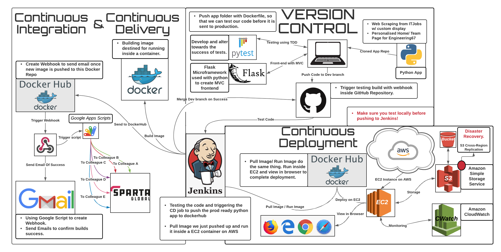

# Engineering 89: Final Project 

## Introduction 

This repository details the processes required to setup and run the job jobcentre++ application. 

## Project Scope  

## Team members:

**Front-end**:
- [Aman](https://github.com/Ahhhh-man) 
- [Mad](https://github.com/monotiller)
- [Niki](https://github.com/NikiNikiforidi)
- [Saim](https://github.com/saim22r)
- [Tom](https://github.com/twilliams9397)

**Backend**:
- [Brittany](https://github.com/brittanyharrison)
- [Dini](https://github.com/DiniH1)
- [Mueed](https://github.com/mueed-shah)
- [Prathima](https://github.com/prathimaautomation)
- [Salem](https://github.com/SBenkhelfaSparta) 

**Automation**:
- [Connor](https://github.com/connorHayler)
- [Filipe](https://github.com/Filipe-Seixas) 
- [Ray](https://github.com/RayWLMo)
- [Ron](https://github.com/rurbonas)
- [Shervin](https://github.com/S-ghanbary98) 

## Software and Tools

- MVC - Flask 

- Jenkins 

- Docker

- AWS - EC2, S3 

- Google app scripts

- Kubernetes

- CloudWatch

## Running the Application

