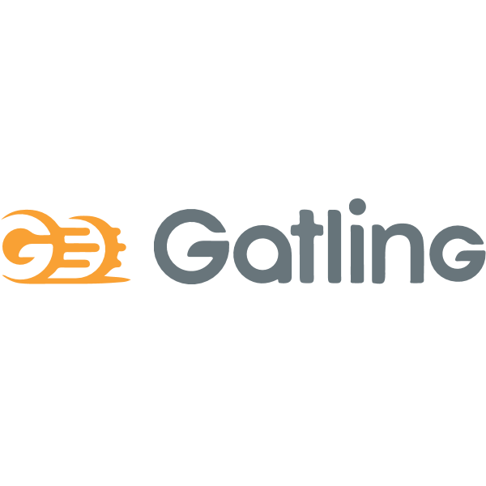

# Engineering 89: Final Project 

## Introduction 

This repository details the processes required to setup and run the [jobcentre++ web application](https://github.com/engineering89-final-project/jcpp). 

## Project Scope  

The aim of this project is to provide a End to End automation pipeline for the jobcentre++ web application. This included:

- Test Driven Development(TDD) for the app
- Continuous Integration using Jenkins
- Continuous Delivery and Deployment with AWS EC2 
- Containerisation and Deployment with Docker 
- Data Persistency using S3 buckets
- Cloud Monitoring with CloudWatch

For detailed documentation on each step to achieve this End to End pipline, oplease refer to the [wiki](https://github.com/brittanyharrison/final_project_backend/wiki) of this repository.  

## Team members:

**Front-end**:
- [Aman](https://github.com/Ahhhh-man) 
- [Mad](https://github.com/monotiller)
- [Niki](https://github.com/NikiNikiforidi)
- [Saim](https://github.com/saim22r)
- [Tom](https://github.com/twilliams9397)

**Backend**:
- [Brittany](https://github.com/brittanyharrison)
- [Dini](https://github.com/DiniH1)
- [Mueed](https://github.com/mueed-shah)
- [Prathima](https://github.com/prathimaautomation)
- [Salem](https://github.com/SBenkhelfaSparta) 

**Automation**:
- [Connor](https://github.com/connorHayler)
- [Filipe](https://github.com/Filipe-Seixas) 
- [Ray](https://github.com/RayWLMo)
- [Ron](https://github.com/rurbonas)
- [Shervin](https://github.com/S-ghanbary98) 

## Software and Tools

<!-- ALL-TOPICS-LIST:START -->
<!-- prettier-ignore-start -->
<!-- markdownlint-disable -->

<table>
  <tr>
    <td align="center"><a href="#jenkins"> <b>Jenkins</b></a></td>
    <td align="center"><a href="#git"> <b>Git</b></a></td>
    <td align="center"><a href="#cloudwatch"> <b>cloudwatch</b></a></td>

  </tr>
  <tr>
    <td align="center"><a href="#Google app scripts"> <b>Google App script</b></a></td>
    <td align="center"><a href="#python"> <b>Python</b></a></td>
    <td align="center"><a href="#kubernetes"> <b>Kubernetes</b></a></td>
  </tr>
  <tr>
    <td align="center"><a href="#docker"> <b>Docker</b></a></td>
    <td align="center"><a href="#flask"> <b>Flask</b></a></td>
    <td align="center"><a href="#gatling"> <b>Gatling</b></a></td>
  </tr>

